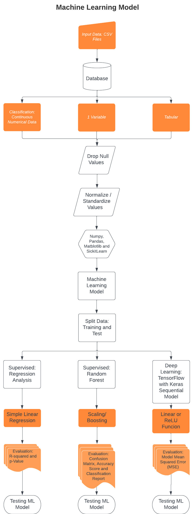

# Introduction
This is the final project for Data Analytics Bootcamp (Group 4). We integrated the data analystic skills and tools we learnt from the bootcamp into this final project.

# Please Create Your Own Branch before merging to Main Branch
* branch name can be: `oil_db`, `oil_ml`, `oil_tech` etc...

## Objective
* Topic: to be fill-in
* Why we select this topic
  
## Source of Data
* List out the sources of data

## Questions to Answer with the Data
* to be fill-in
  
## Communication Protocols
* We created a private group chat in `Slack` as the primary communication channel within the team.
* We also used Zoom meeting for group collaboration.

## Machine Learning Model
* The models will use one dependent variable (stock price) and one independent variable (oil price).
* The programming language will be Python and the mais libraries are: Numpy, Pandas, Matplotlib and SickitLearn. 
* We have decided to use 3 different Machine Learning Models: Regression Analysis, Random Forest and Tensor Flow.

* 

## Database Model
* by *Yidan*

## Technologies Use
* by *Bowen*
