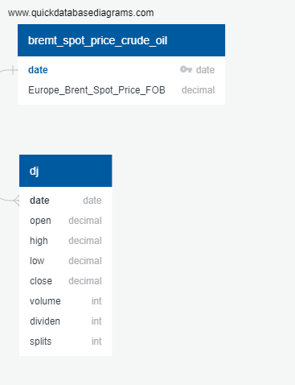

# Energy ETF RYE Forecast

This is the final project for Data Analytics Bootcamp for our group (Group 4). We have integrated the data analystic skills and tools we have learnt from the bootcamp into this final project.

We aim to, based on the crude oil price and ETF price, forecast the future value of an Energy ETF price (Invesco S&P 500® Equal Weight Energy ETF).

## Presentation

We prepared a [Google Slide](https://docs.google.com/presentation/d/1M9gE1Wv08GLSOgKtwCtLHypvGdmYd1BzGTxuklBDWRo/edit?usp=sharing) for presentation purpose.

## Purpose of this Project

### Background

Brent crude spot price jumped to $133 a barrel on March 8, 2022 and it represents the highest oil prices since 2008. Oil companies supply billions of barrels of petroleum products daily to power transportation and industry. The fluctuation of the crude oil price has direct impact on the production cost of the carbon-based fuels and products, which in turn impacting the profitability and the stock prices of the oil companies. In this project, we would like bring insights to fund managers and investors who are interested in investing the oil-related sector. We will study if there is any relationship between the crude oil price and the Energy ETF (RYE).

### Questions to be Answered

1. Are there seasonal trends and patterns on the Energy ETF? Can we forecast the future ETF prices solely based on the historical ETF prices (time series)?
2. Is there any relationship between the crude oil prices and the ETF prices? Can we forecast the future ETF price based on both the historical ETF prices and the historical crude oil prices?

### Benefits

The value investment theories indicate that the market/nominal stock value of any company tends to approach the real value. If a stock is under-valued for now, the stock price tends to increase. If a stock is over-valued for now, the stock price is likely to decrease over time. 

If we are able to determine the relationship between the stock prices of the oil companies and the crude oil prices, investors or fund managers will be able to make better decisions when analyzing the stock market. 

### Team Collaboration - Communication Protocols

* We created a private group chat in `Slack` as the primary communication channel within the team.
* We also used Zoom meeting for group collaboration.

Details on our presentation of the project can also be found in the [presentation](https://github.com/kobertlam/Oil_Price_and_Stock_Price_Analysis/tree/presentation) branch.

## Data Source

The data that we will be using are from the following sources. The data tables are available in the [dataset](https://github.com/kobertlam/Oil_Price_and_Stock_Price_Analysis/tree/dataset) branch. 

1. Dataset for [Brent Crude Oil Price](https://www.eia.gov/dnav/pet/hist_xls/RBRTEd.xls) (Brent Spot Price, dollars per Barrel) from U.S. Energy Information Administration
2. [Nasdaq Screener](https://www.nasdaq.com/market-activity/stocks/screener) to select top 10 oil companies
3. Stock price from [`yfinance`](https://pypi.org/project/yfinance/) Yahoo! Finance's API 

## Machine Learning Models

Details on the our machine learning models can also be found in the [machine_learning_model](https://github.com/kobertlam/Oil_Price_and_Stock_Price_Analysis/tree/machine_learning_model) branch. 

### Labels

For now, our models will use one dependent variable and only one independent variable for now. More can be explored in the future. 

The dependent variable (Y) will be the scaled stock price of the portfolio composed of 10 largest oil companies. 

The independent variable (X) will be the brent spot price of the crude oil. 

### Proposed Machine Learning Models to Use

1. Supervised Regression Analysis: establish a relationship between the two variables by estimating how much one variable affects the other.
2. Random Forest: take into consideration mutliple regression decision trees and calculates the averages of all predictions to generate an expected stock price.
3. TensorFlow with Keras Sequential Model: Deep learning model where each layer receives input information, calculate the parameters and output the information transformed, following the same process to the next layer until the final result. 

### Flow Chart

The flow chart can be seen below. 

## Database

We've decided to use SQL, and the ERD was created based on the datasets below:
1. brent_spot_price_crude_oil
* Primary key: date
2. nasdaq_screener
* Foreign key: date

Our ERD is shown below and details can also be found in the [database](https://github.com/kobertlam/Oil_Price_and_Stock_Price_Analysis/tree/database) branch. 

## Dashboard

We export the data from [`master.ipynb`](https://github.com/kobertlam/Energy_ETF_RYE_Forecast/tree/main/master.ipynb) into CSV files, and then import the CSV files into **Tablueau Public** to create interactive dashboard.

Here is the outline of the dashboard:

The dashboard will include the following viz:
1. A Heatmap for Energy ETF (RYE) portfolio breakdown
2. A bar chart showing the market value of the individual company within RYE
3. A time-series plot showing both the Brent crude oil price and RYE price
4. A time-series plot showing the seasonal changes on oil and RYE price
5. A time-series plot showing the RYE price and trading volume

The interactive elements:
* There will be a linkage between the heatmap and bar chart, so that user can filter the data by **Sector**, and both charts will be updated based on the selected Sector

## Technologies Used

Details can also be found in the [technologies](https://github.com/kobertlam/Oil_Price_and_Stock_Price_Analysis/tree/technologies) branch. 

### Data Cleaning and Analysis
Pandas will be used to clean the data and perform an exploratory analysis. Further analysis will be completed using Python/Jupyter Notebook/Jupyter Lab.

### Database Storage
PostgreSQL is the database we intend to use, and we will connect to the database through Python/Jupyter Notebook/Jupyter Lab.

### Machine Learning

Regression Analysis, Random Forest, TensorFlow with Keras Sequential Model are the Machine Learning libraries we'll be using. Please refer to the [Machine Learning Models](https://github.com/kobertlam/Oil_Price_and_Stock_Price_Analysis#machine-learning-model) section. Details can also be found in the [machine_learning_model](https://github.com/kobertlam/Oil_Price_and_Stock_Price_Analysis/tree/machine_learning_model) branch. 

### Dashboard
Tableau will be used to create a interactive dashboard. 
