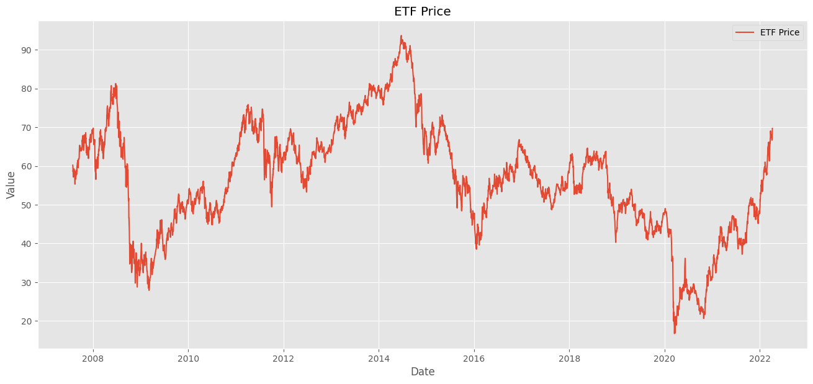
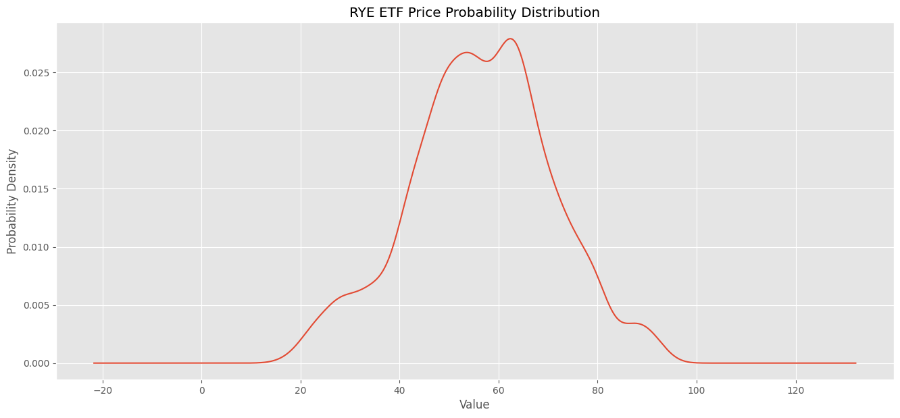
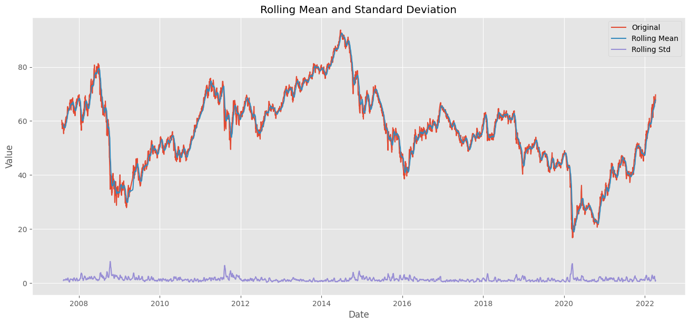
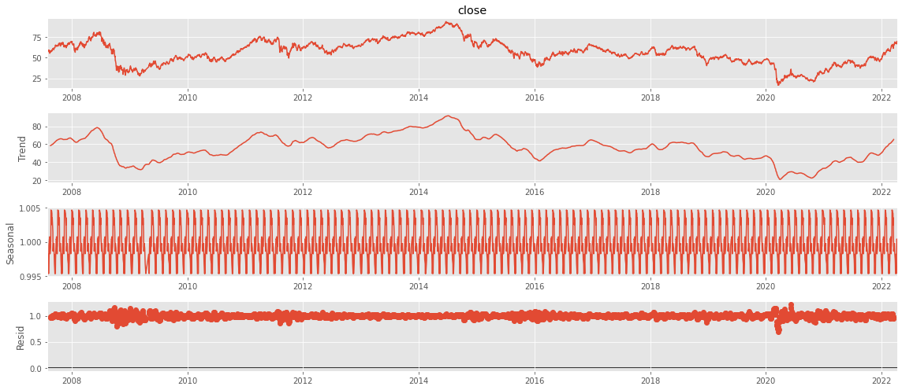
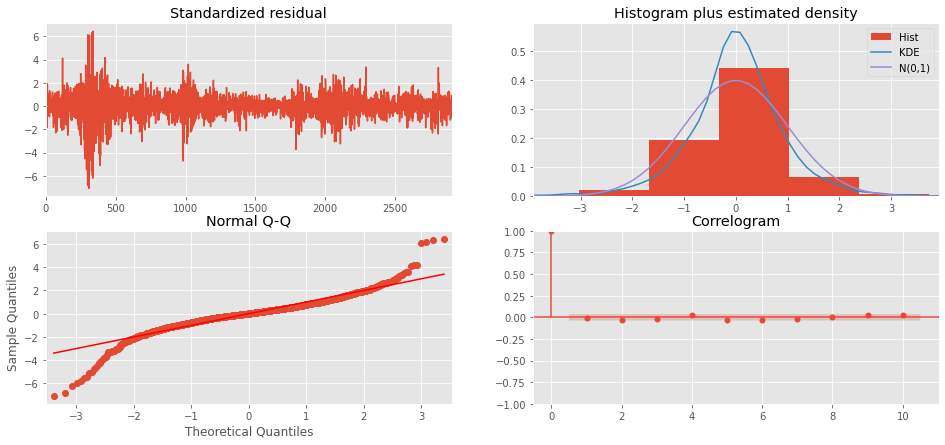
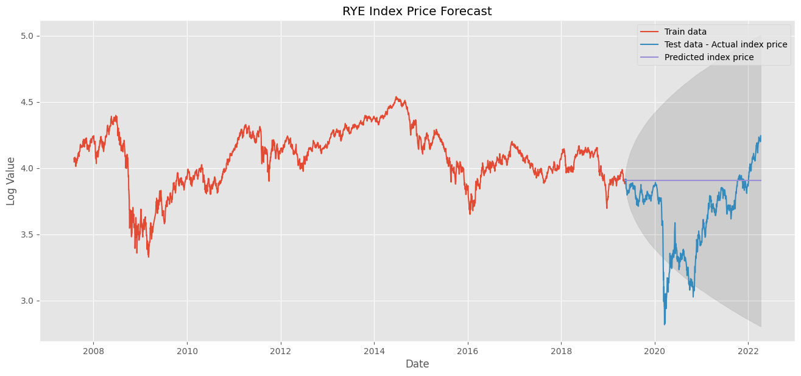
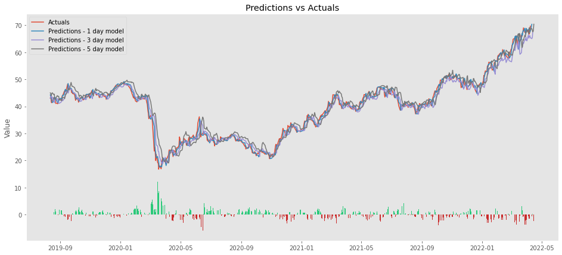

# Machine Learning Models

## Data preprocessing

After acquiring our datasets, we have imported them into our Jupyter Notebook, conducted some preprocessing, and completed some preliminary analysis. 

Below shows the historical daily close prices of the Invesco S&P 500 Equal Weight Energy ETF, which is an exchange traded fund with a portfolio of companies in the energy sector. 

The data is also visualized below through a probability distribution. 

Commonly, a given time series consist of three systematic components and one non-systematic component. The three systematic components include Level, Trend, and Seasonality. The one non-systematic component is noice. 

## Feature engineering and selection

## Data split into training and testing sets

## Models of choice

### ARIMA

### Sequential

## Results

## Labels

For now, our models will use one dependent variable and only one independent variable for now. More can be explored in the future. 

The dependent variable (Y) will be the scaled stock price of the portfolio composed of 10 largest oil companies. 

The independent variable (X) will be the brent spot price of the crude oil. 

## Proposed Machine Learning Models to Use

1. Supervised Regression Analysis: establish a relationship between the two variables by estimating how much one variable affects the other.
2. Random Forest: take into consideration mutliple regression decision trees and calculates the averages of all predictions to generate an expected stock price.
3. TensorFlow with Keras Sequential Model: Deep learning model where each layer receives input information, calculate the parameters and output the information transformed, following the same process to the next layer until the final result. 

## Flow Chart

The flow chart can be seen below. 

